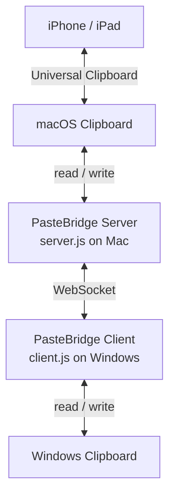

<p align="right">
  <strong>EN</strong> | <a href="./README.zh-CN.md">简</a> | <a href="./README.zh-TW.md">繁</a>
</p>

<div align="center">
    <h1>PasteBridge</h1>

  <p>
    
    
    
    
  </p>
</div>

PasteBridge is a lightweight, self-hosted clipboard relay between Windows and the Apple clipboard ecosystem.

Run the server on your Mac, run the client on Windows, and sync text or images between both machines over WebSocket. Because the Mac writes into the native macOS clipboard, copied content can also participate in Apple's Universal Clipboard workflow with nearby iPhone and iPad devices.

---

## Features

- Bidirectional clipboard sync between macOS and Windows
- Copy on iPhone and paste on Windows through macOS Universal Clipboard
- Copy on Windows and paste on iPhone through the Mac bridge
- Supports text and images
- Uses binary WebSocket frames for image payloads
- No cloud account or hosted sync service required
- Shared-token authentication and optional TLS transport
- Duplicate-message protection and stale-message ordering control
- Auto reconnect, heartbeat cleanup, and configurable polling intervals
- Small modular codebase for hacking, self-hosting, and extension

---

## How It Works

`server.js` runs on macOS and watches the macOS clipboard. `client.js` runs on Windows and watches the Windows clipboard. When either side detects a change, it sends a protocol message to the other side.



The Mac acts as the bridge. Windows connects to it as a client.

---

## Quick Start

1. Clone the repository on both machines:

```bash
git clone https://github.com/Javis603/PasteBridge
cd PasteBridge
```

2. Install dependencies:

```bash
npm install
```

3. Install `pngpaste` on the Mac:

```bash
brew install pngpaste
```

4. Create the Mac `.env`:

```bash
cp .env.server.example .env
```

5. Create the Windows `.env`:

```powershell
copy .env.client.example .env
```

6. Set the same `AUTH_TOKEN` on both machines.

7. Set `SERVER_IP` on Windows to your Mac's reachable IP address, preferably through ZeroTier, Tailscale, or your LAN.

8. Start the Mac server:

```bash
npm run server
```

9. Start the Windows client:

```bash
npm run client
```

10. Copy text or an image on one machine and paste on the other.

---

## Requirements

**macOS server**

- Node.js 16 or newer
- [`pngpaste`](https://github.com/jcsalterego/pngpaste)

**Windows client**

- Node.js 16 or newer
- PowerShell, included with Windows

**Network**

- Windows must be able to reach the Mac on `PORT`
- ZeroTier or Tailscale is recommended for devices on different networks

---

## Configuration

PasteBridge intentionally uses separate example files for each side:

- `.env.server.example` for the Mac server
- `.env.client.example` for the Windows client
- `.env.example` as a short pointer explaining which file to copy

Do not put both server and client settings in the same `.env`; duplicate keys such as `AUTH_TOKEN` and `SENDER_ID` will override each other.

### Server

```env
PORT=8765
AUTH_TOKEN=replace-with-a-long-random-shared-secret
SENDER_ID=server-your-mac-name

TLS_CERT_PATH=
TLS_KEY_PATH=

MAX_TEXT_BYTES=4MB
MAX_IMAGE_BYTES=25MB
MAX_WS_BUFFER_BYTES=16MB
MESSAGE_CACHE_SIZE=1000
MESSAGE_CACHE_TTL_MS=300000
POLL_INTERVAL_MS=1000
SUPPRESS_MS=5000
HEARTBEAT_INTERVAL_MS=15000
```

### Client

```env
SERVER_IP=your.mac.ip.address
PORT=8765
AUTH_TOKEN=replace-with-the-same-shared-secret
SENDER_ID=client-your-windows-name

USE_TLS=false
TLS_CA_PATH=

MAX_TEXT_BYTES=4MB
MAX_IMAGE_BYTES=25MB
MAX_WS_BUFFER_BYTES=16MB
MESSAGE_CACHE_SIZE=1000
MESSAGE_CACHE_TTL_MS=300000
POLL_INTERVAL_MS=1000
SUPPRESS_MS=5000
RECONNECT_DELAY_MS=5000
MAX_RECONNECT_DELAY_MS=30000
```

### Useful Options

- `AUTH_TOKEN`: shared secret required for WebSocket connections
- `SENDER_ID`: stable node name used in logs and ordering logic
- `POLL_INTERVAL_MS`: clipboard polling interval
- `MAX_TEXT_BYTES`: maximum text payload size, supports values like `512KB`, `4MB`, `1GB`
- `MAX_IMAGE_BYTES`: maximum image payload size
- `MAX_WS_BUFFER_BYTES`: backpressure limit before outgoing messages are skipped
- `MESSAGE_CACHE_SIZE`: number of recent message IDs kept for replay protection
- `MESSAGE_CACHE_TTL_MS`: how long recent message IDs are remembered

---

## Security Model

PasteBridge is designed for trusted devices.

- Set a strong `AUTH_TOKEN` on both machines.
- Prefer ZeroTier, Tailscale, or a trusted LAN.
- If exposing the server beyond a trusted network, enable TLS with `TLS_CERT_PATH` and `TLS_KEY_PATH`, or put it behind a trusted TLS proxy or VPN.
- Clipboard contents may include passwords, tokens, and private data. Treat network access to PasteBridge as sensitive.

---

## Network Setup

The Windows client must be able to connect to the Mac server.

| Method | When to use |
|---|---|
| [ZeroTier](https://www.zerotier.com) | Recommended for devices on different networks |
| [Tailscale](https://tailscale.com) | Good WireGuard-based alternative |
| LAN IP | Simple if both machines are on the same local network |
| Public IP | Only with a trusted tunnel, VPN, TLS proxy, or TLS enabled |

### ZeroTier Example

1. Create a network at [my.zerotier.com](https://my.zerotier.com).
2. Join the same ZeroTier network from both machines.
3. Find the Mac's ZeroTier IP.
4. Put that IP in `SERVER_IP` on the Windows client.

---

## Auto Start

macOS uses PM2's startup hook for the server. Windows uses Task Scheduler to
start the client directly at login.

### macOS

```bash
cd PasteBridge
npm install -g pm2
pm2 start server.js --name pastebridge-server
pm2 save
pm2 startup
```

Run the command printed by `pm2 startup`.

### Windows

Run these in PowerShell:

```powershell
cd PasteBridge

$projectDir = (Get-Location).Path
$node = (Get-Command node.exe).Source
$action = New-ScheduledTaskAction -Execute $node -Argument 'client.js' -WorkingDirectory $projectDir
$trigger = New-ScheduledTaskTrigger -AtLogOn
Register-ScheduledTask -TaskName 'PasteBridge Client' -Action $action -Trigger $trigger -Description 'Start PasteBridge client on logon' -Force
```

---

## Limitations

- macOS is currently the server, and Windows is currently the client.
- iPhone and iPad support is indirect through macOS Universal Clipboard, not through a native iOS app.
- Clipboard change detection is polling-based, not native event-driven.
- Universal Clipboard availability is controlled by macOS and may expire after a short period of inactivity.
- This is not a clipboard history manager.

---

## Development

Run tests:

```bash
npm test
```

Project structure:

- `server.js` and `client.js`: thin entrypoints
- `src/common/`: config, protocol, logging, WebSocket helpers
- `src/platform/`: macOS and Windows clipboard adapters
- `src/server/`: server app and transport bootstrap
- `src/client/`: client app and reconnect logic
- `test/`: logic tests for config, protocol, replay protection, ordering, and URL generation

---

## Roadmap

- Native event-driven clipboard monitoring
- Optional ANSI escape stripping for terminal clipboard content
- Installation helpers for macOS LaunchAgent and Windows Service
- More integration tests around reconnect and platform clipboard failures
- Optional end-to-end encryption above the transport layer

---

## License

This project is licensed under the MIT License. See the [LICENSE](LICENSE) file for details.
