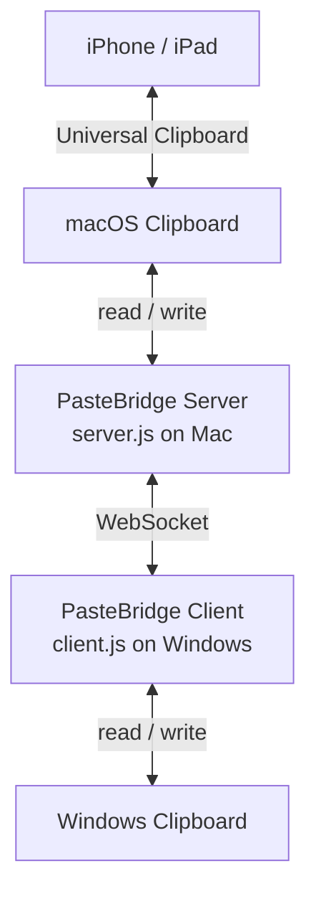

<p align="right">
  <a href="./README.md">EN</a> | <strong>简</strong> | <a href="./README.zh-TW.md">繁</a>
</p>

<div align="center">
    <h1>PasteBridge</h1>

  <p>
    
    
    
    
  </p>
</div>

PasteBridge 是一个轻量、自托管的剪贴板桥接工具，用来在 Windows 和 Apple 生态之间同步剪贴板。

在 Mac 上运行 server，在 Windows 上运行 client，就可以通过 WebSocket 在两台机器之间同步文字和图片。因为 Mac 端会写入原生 macOS 剪贴板，所以内容也可以通过 Apple Universal Clipboard 间接流向附近的 iPhone / iPad。

---

## 特色

- macOS 和 Windows 双向剪贴板同步
- 可以从 iPhone 复制，通过 Mac 粘贴到 Windows
- 可以从 Windows 复制，通过 Mac 粘贴到 iPhone
- 支持文字和图片
- 图片使用 binary WebSocket frame，避免 base64 额外开销
- 不需要云端账号，也不依赖第三方同步服务
- 支持 shared token 验证和可选 TLS 传输
- 内置重复消息保护与过期消息顺序控制
- 支持自动重连、heartbeat 清理和可调整轮询间隔
- 代码结构小而清楚，适合自托管、修改和扩展

---

## 工作方式

`server.js` 在 macOS 上运行并监听 macOS 剪贴板。`client.js` 在 Windows 上运行并监听 Windows 剪贴板。任一端检测到剪贴板变化后，会把协议消息发送到另一端。



Mac 会作为桥接端，Windows 会连接到 Mac server。

---

## 快速开始

1. 在两台机器 clone repository：

```bash
git clone https://github.com/Javis603/PasteBridge
cd PasteBridge
```

2. 安装依赖：

```bash
npm install
```

3. 在 Mac 安装 `pngpaste`：

```bash
brew install pngpaste
```

4. 创建 Mac 的 `.env`：

```bash
cp .env.server.example .env
```

5. 创建 Windows 的 `.env`：

```powershell
copy .env.client.example .env
```

6. 在两台机器设置相同的 `AUTH_TOKEN`。

7. 在 Windows 的 `.env` 把 `SERVER_IP` 设置成 Mac 可以连接到的 IP，建议使用 ZeroTier、Tailscale 或同一个 LAN。

8. 启动 Mac server：

```bash
npm run server
```

9. 启动 Windows client：

```bash
npm run client
```

10. 在其中一台机器复制文字或图片，然后在另一台机器粘贴。

---

## 系统需求

**macOS server**

- Node.js 16 或以上
- [`pngpaste`](https://github.com/jcsalterego/pngpaste)

**Windows client**

- Node.js 16 或以上
- PowerShell，Windows 内置

**网络**

- Windows 必须可以连接到 Mac 的 `PORT`
- 如果两台机器不在同一个网络，建议使用 ZeroTier 或 Tailscale

---

## 设置

PasteBridge 会为两端使用不同的示例配置文件：

- `.env.server.example`：Mac server 使用
- `.env.client.example`：Windows client 使用
- `.env.example`：只是一个简短提示，说明应该复制哪一份

不要把 server 和 client 设置放进同一个 `.env`。像 `AUTH_TOKEN`、`SENDER_ID` 这类重复 key 会互相覆盖。

### Server

```env
PORT=8765
AUTH_TOKEN=replace-with-a-long-random-shared-secret
SENDER_ID=server-your-mac-name

TLS_CERT_PATH=
TLS_KEY_PATH=

MAX_TEXT_BYTES=4MB
MAX_IMAGE_BYTES=25MB
MAX_WS_BUFFER_BYTES=16MB
MESSAGE_CACHE_SIZE=1000
MESSAGE_CACHE_TTL_MS=300000
POLL_INTERVAL_MS=1000
SUPPRESS_MS=5000
HEARTBEAT_INTERVAL_MS=15000
```

### Client

```env
SERVER_IP=your.mac.ip.address
PORT=8765
AUTH_TOKEN=replace-with-the-same-shared-secret
SENDER_ID=client-your-windows-name

USE_TLS=false
TLS_CA_PATH=

MAX_TEXT_BYTES=4MB
MAX_IMAGE_BYTES=25MB
MAX_WS_BUFFER_BYTES=16MB
MESSAGE_CACHE_SIZE=1000
MESSAGE_CACHE_TTL_MS=300000
POLL_INTERVAL_MS=1000
SUPPRESS_MS=5000
RECONNECT_DELAY_MS=5000
MAX_RECONNECT_DELAY_MS=30000
```

### 常用选项

- `AUTH_TOKEN`：WebSocket 连接需要的 shared secret
- `SENDER_ID`：节点名称，用于 log 和消息顺序控制
- `POLL_INTERVAL_MS`：剪贴板轮询间隔
- `MAX_TEXT_BYTES`：最大文字 payload，支持 `512KB`、`4MB`、`1GB` 这类写法
- `MAX_IMAGE_BYTES`：最大图片 payload
- `MAX_WS_BUFFER_BYTES`：WebSocket backpressure 上限
- `MESSAGE_CACHE_SIZE`：最近消息 ID 缓存大小，用于防止重放
- `MESSAGE_CACHE_TTL_MS`：最近消息 ID 保留时间

---

## 安全模型

PasteBridge 是为可信任设备设计的。

- 两台机器都要设置强一点的 `AUTH_TOKEN`。
- 建议使用 ZeroTier、Tailscale 或可信任 LAN。
- 如果要暴露到可信网络以外，请启用 `TLS_CERT_PATH` / `TLS_KEY_PATH`，或放在可信任的 TLS proxy / VPN 后面。
- 剪贴板内容可能包含密码、token 和私人数据，请把 PasteBridge 的网络访问视为敏感入口。

---

## 网络设置

Windows client 必须能连接到 Mac server。

| 方式 | 适合场景 |
|---|---|
| [ZeroTier](https://www.zerotier.com) | 推荐，用于不同网络的设备 |
| [Tailscale](https://tailscale.com) | 基于 WireGuard 的好选择 |
| LAN IP | 两台机器在同一个本地网络 |
| Public IP | 只建议搭配可信 tunnel、VPN、TLS proxy 或启用 TLS |

### ZeroTier 示例

1. 在 [my.zerotier.com](https://my.zerotier.com) 创建 network。
2. 两台机器加入同一个 ZeroTier network。
3. 找到 Mac 的 ZeroTier IP。
4. 把这个 IP 填到 Windows client 的 `SERVER_IP`。

---

## 自动启动

两台机器都由 PM2 管理 PasteBridge process。macOS 使用 PM2 的 startup hook，Windows 则使用内置任务计划程序在登录时恢复已保存的 PM2 process list。

### macOS

```bash
cd PasteBridge
npm install -g pm2
pm2 start server.js --name pastebridge-server
pm2 save
pm2 startup
```

执行 `pm2 startup` 显示出来的那条命令。

### Windows

在 PowerShell 执行：

```powershell
cd PasteBridge
npm install -g pm2
pm2 start client.js --name pastebridge-client
pm2 save

$pm2 = (Get-Command pm2.cmd).Source
$action = New-ScheduledTaskAction -Execute $pm2 -Argument 'resurrect'
$trigger = New-ScheduledTaskTrigger -AtLogOn
Register-ScheduledTask -TaskName 'PasteBridge Client' -Action $action -Trigger $trigger -Description 'Start PasteBridge client through PM2 on logon' -Force
```

---

## 当前限制

- 目前 macOS 是 server，Windows 是 client。
- iPhone / iPad 支持是通过 macOS Universal Clipboard 间接完成，并不是原生 iOS app。
- 剪贴板变化检测目前仍然是 polling，不是原生事件驱动。
- Universal Clipboard 可用时间由 macOS 控制，一段时间没有互动后可能会失效。
- 这不是剪贴板历史管理工具。

---

## 开发

运行测试：

```bash
npm test
```

项目结构：

- `server.js` 和 `client.js`：很薄的启动入口
- `src/common/`：设置、协议、log、WebSocket helper
- `src/platform/`：macOS 和 Windows 剪贴板 adapter
- `src/server/`：server app 和 transport 启动
- `src/client/`：client app 和重连逻辑
- `test/`：设置、协议、防重放、顺序控制、URL 生成等逻辑测试

---

## Roadmap

- 原生事件驱动剪贴板监听
- 可选的 ANSI escape 清理，用于终端复制内容
- macOS LaunchAgent 和 Windows Service 安装 helper
- 更多重连与平台剪贴板失败场景的集成测试
- transport layer 之上的可选端到端加密

---

## License

本项目采用 MIT License 授权。详情请查看 [LICENSE](LICENSE) 文件。
