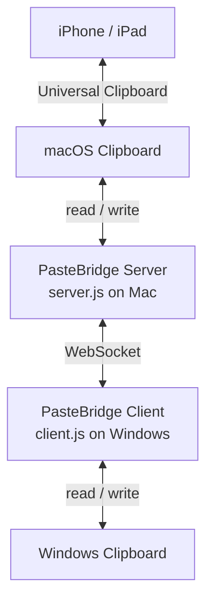

<p align="right">
  <a href="./README.md">EN</a> | <a href="./README.zh-CN.md">简</a> | <strong>繁</strong>
</p>

<div align="center">
    <h1>PasteBridge</h1>

  <p>
    
    
    
    
  </p>
</div>

PasteBridge 是一個輕量、自架的剪貼簿橋接工具，用來在 Windows 和 Apple 生態之間同步剪貼簿。

在 Mac 上執行 server，在 Windows 上執行 client，就可以透過 WebSocket 在兩台機器之間同步文字和圖片。因為 Mac 端會寫入原生 macOS 剪貼簿，所以內容也可以透過 Apple Universal Clipboard 間接流向附近的 iPhone / iPad。

---

## 特色

- macOS 和 Windows 雙向剪貼簿同步
- 可以從 iPhone 複製，透過 Mac 貼到 Windows
- 可以從 Windows 複製，透過 Mac 貼到 iPhone
- 支援文字和圖片
- 圖片使用 binary WebSocket frame，避免 base64 額外開銷
- 不需要雲端帳號，也不依賴第三方同步服務
- 支援 shared token 驗證和可選 TLS 傳輸
- 內建重複訊息保護與過期訊息順序控制
- 支援自動重連、heartbeat 清理和可調整輪詢間隔
- 程式碼結構小而清楚，適合自架、修改和延伸

---

## 運作方式

`server.js` 在 macOS 上執行並監看 macOS 剪貼簿。`client.js` 在 Windows 上執行並監看 Windows 剪貼簿。任一端偵測到剪貼簿變化後，會把協議訊息送到另一端。



Mac 會作為橋接端，Windows 會連到 Mac server。

---

## 快速開始

1. 在兩台機器安裝依賴：

```bash
npm install
```

2. 在 Mac 安裝 `pngpaste`：

```bash
brew install pngpaste
```

3. 建立 Mac 的 `.env`：

```bash
cp .env.server.example .env
```

4. 建立 Windows 的 `.env`：

```powershell
copy .env.client.example .env
```

5. 在兩台機器設定相同的 `AUTH_TOKEN`。

6. 在 Windows 的 `.env` 把 `SERVER_IP` 設成 Mac 可連到的 IP，建議使用 ZeroTier、Tailscale 或同一個 LAN。

7. 啟動 Mac server：

```bash
npm run server
```

8. 啟動 Windows client：

```bash
npm run client
```

9. 在其中一台機器複製文字或圖片，然後在另一台機器貼上。

---

## 系統需求

**macOS server**

- Node.js 16 或以上
- [`pngpaste`](https://github.com/jcsalterego/pngpaste)

**Windows client**

- Node.js 16 或以上
- PowerShell，Windows 內建

**網路**

- Windows 必須可以連到 Mac 的 `PORT`
- 如果兩台機器不在同一個網路，建議使用 ZeroTier 或 Tailscale

---

## 設定

PasteBridge 會為兩端使用不同的範例設定檔：

- `.env.server.example`：Mac server 使用
- `.env.client.example`：Windows client 使用
- `.env.example`：只是一個簡短提示，說明應該複製哪一份

不要把 server 和 client 設定放進同一個 `.env`。像 `AUTH_TOKEN`、`SENDER_ID` 這類重複 key 會互相覆蓋。

### Server

```env
PORT=8765
AUTH_TOKEN=replace-with-a-long-random-shared-secret
SENDER_ID=server-your-mac-name

TLS_CERT_PATH=
TLS_KEY_PATH=

MAX_TEXT_BYTES=4MB
MAX_IMAGE_BYTES=25MB
MAX_WS_BUFFER_BYTES=16MB
MESSAGE_CACHE_SIZE=1000
MESSAGE_CACHE_TTL_MS=300000
POLL_INTERVAL_MS=1000
SUPPRESS_MS=5000
HEARTBEAT_INTERVAL_MS=15000
```

### Client

```env
SERVER_IP=your.mac.ip.address
PORT=8765
AUTH_TOKEN=replace-with-the-same-shared-secret
SENDER_ID=client-your-windows-name

USE_TLS=false
TLS_CA_PATH=

MAX_TEXT_BYTES=4MB
MAX_IMAGE_BYTES=25MB
MAX_WS_BUFFER_BYTES=16MB
MESSAGE_CACHE_SIZE=1000
MESSAGE_CACHE_TTL_MS=300000
POLL_INTERVAL_MS=1000
SUPPRESS_MS=5000
RECONNECT_DELAY_MS=5000
MAX_RECONNECT_DELAY_MS=30000
```

### 常用選項

- `AUTH_TOKEN`：WebSocket 連線需要的 shared secret
- `SENDER_ID`：節點名稱，用於 log 和訊息順序控制
- `POLL_INTERVAL_MS`：剪貼簿輪詢間隔
- `MAX_TEXT_BYTES`：最大文字 payload，支援 `512KB`、`4MB`、`1GB` 這類寫法
- `MAX_IMAGE_BYTES`：最大圖片 payload
- `MAX_WS_BUFFER_BYTES`：WebSocket backpressure 上限
- `MESSAGE_CACHE_SIZE`：最近訊息 ID 快取大小，用於防止重播
- `MESSAGE_CACHE_TTL_MS`：最近訊息 ID 保留時間

---

## 安全模型

PasteBridge 是為可信任裝置設計的。

- 兩台機器都要設定強一點的 `AUTH_TOKEN`。
- 建議使用 ZeroTier、Tailscale 或可信任 LAN。
- 如果要暴露到可信網路以外，請啟用 `TLS_CERT_PATH` / `TLS_KEY_PATH`，或放在可信任的 TLS proxy / VPN 後面。
- 剪貼簿內容可能包含密碼、token 和私人資料，請把 PasteBridge 的網路存取視為敏感入口。

---

## 網路設定

Windows client 必須能連到 Mac server。

| 方式 | 適合場景 |
|---|---|
| [ZeroTier](https://www.zerotier.com) | 推薦，用於不同網路的裝置 |
| [Tailscale](https://tailscale.com) | 基於 WireGuard 的好選擇 |
| LAN IP | 兩台機器在同一個本地網路 |
| Public IP | 只建議搭配可信 tunnel、VPN、TLS proxy 或啟用 TLS |

### ZeroTier 範例

1. 在 [my.zerotier.com](https://my.zerotier.com) 建立 network。
2. 兩台機器加入同一個 ZeroTier network。
3. 找到 Mac 的 ZeroTier IP。
4. 把這個 IP 填到 Windows client 的 `SERVER_IP`。

---

## 自動啟動

### macOS

```bash
npm install -g pm2
pm2 start server.js --name pastebridge-server
pm2 save
pm2 startup
```

執行 `pm2 startup` 顯示出來的那條指令。

### Windows

```powershell
npm install -g pm2 pm2-windows-startup
pm2-windows-startup install
pm2 start client.js --name pastebridge-client
pm2 save
```

---

## 目前限制

- 目前 macOS 是 server，Windows 是 client。
- iPhone / iPad 支援是透過 macOS Universal Clipboard 間接完成，並不是原生 iOS app。
- 剪貼簿變化偵測目前仍然是 polling，不是原生事件驅動。
- Universal Clipboard 可用時間由 macOS 控制，一段時間沒有互動後可能會失效。
- 這不是剪貼簿歷史管理工具。

---

## 開發

執行測試：

```bash
npm test
```

專案結構：

- `server.js` 和 `client.js`：很薄的啟動入口
- `src/common/`：設定、協議、log、WebSocket helper
- `src/platform/`：macOS 和 Windows 剪貼簿 adapter
- `src/server/`：server app 和 transport 啟動
- `src/client/`：client app 和重連邏輯
- `test/`：設定、協議、防重播、順序控制、URL 產生等邏輯測試

---

## Roadmap

- 原生事件驅動剪貼簿監聽
- 可選的 ANSI escape 清理，用於終端複製內容
- macOS LaunchAgent 和 Windows Service 安裝 helper
- 更多重連與平台剪貼簿失敗情境的整合測試
- transport layer 之上的可選端到端加密

---

## License

本專案採用 MIT License 授權。詳情請查看 [LICENSE](LICENSE) 文件。
